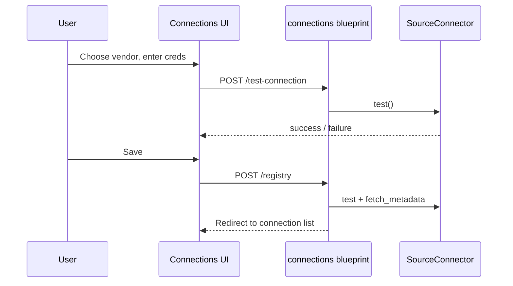
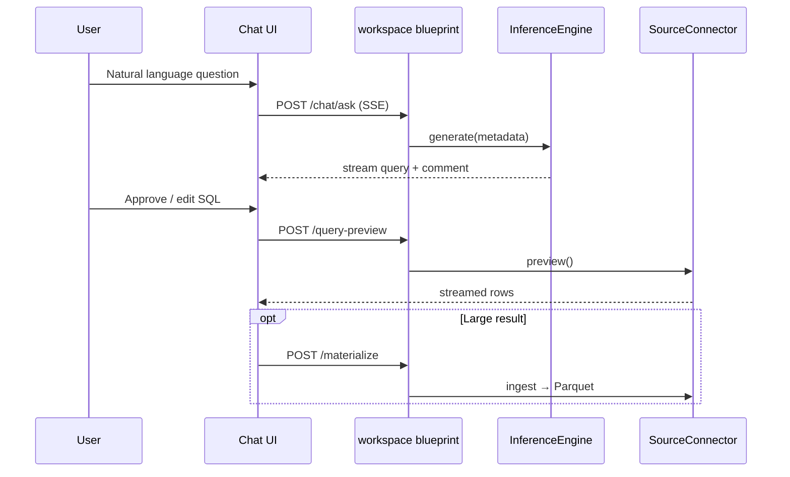

# Design

ScalAble is a natural-language interface to SQL and NoSQL databases. Users describe what they want in plain English; the system generates queries, lets them review and edit, runs them against connected sources, and presents results with optional visualizations and notebook analysis.

## Product vision

From the original project agenda:

> Show generated queries for assessment and editing before execution. After execution, showcase results with integrated visualizations. Streamline the database experience in a fast, efficient, and user-friendly way.

**Core principles:**

1. **Human in the loop** — Generated SQL is visible and editable before execution.
2. **Pushdown** — Prefer filtering and aggregation in the database, not in application memory.
3. **Privacy** — Support local LLMs (Ollama, LM Studio) so data and prompts stay under user control.
4. **Modularity** — Connectors and LLM providers are pluggable.

## User flows

### Connect a data source



Connections persist in the **Flask session** (Redis-backed), with encrypted credentials.

### Ask a question and run SQL



### Notebook analysis

Materialized relations are exposed to a **per-session Jupyter kernel** over Socket.IO. Users run Python/Plotly against Parquet paths mounted at `KERNEL_DATA_MOUNT`.

## Architecture layers

| Layer | Responsibility |
|-------|----------------|
| **Presentation** | Jinja templates, Tailwind/Alpine, HTMX, `notebook.js` |
| **Application** | Flask blueprints, session state, SSE |
| **Inference** | LangChain, provider abstraction, prompt contract |
| **Data plane** | `BaseSource`, preview, ingest, metadata |
| **Compute** | Jupyter kernels, Parquet relations |

See [docs/ARCHITECTURE.md](docs/ARCHITECTURE.md) for module-level detail.

## Design decisions

### XML-tagged LLM output

The inference prompt requires:

```xml
<query>SELECT ...</query>
<comment>Brief explanation</comment>
```

**Why:** Reliable parsing from streamed tokens without brittle JSON-in-stream. The frontend regex-extracts tags in `notebook.js`.

### Two-phase query execution

1. **LLM proposes** SQL using schema metadata only.
2. **Connector executes** after explicit user action (preview/materialize).

**Why:** Prevents accidental destructive queries and keeps the user in control.

### Session-scoped state (no auth yet)

Connections and relations live in Redis-backed sessions.

**Why:** Fast MVP for single-user / trusted deployments. Persistent multi-user storage and login are future work (`SQLALCHEMY_URI` is reserved in settings).

### Preview vs materialize

| Mode | Use case | Implementation |
|------|----------|----------------|
| Preview | Quick look, limited rows | Stream from source (e.g. ADBC) |
| Materialize | Large data, notebook, plots | Parquet on disk + relation registry |

**Why:** Avoid loading huge result sets into browser memory or LLM context.

### Connector registry

Only explicitly registered `source_type` values work at runtime, even if the UI lists more vendors.

**Why:** Safe rollout — UI can advertise upcoming sources before backend wiring is complete.

## Technology choices

| Area | Choice | Rationale |
|------|--------|-----------|
| Backend | Flask + Flask-Session | Simple, fits server-rendered UI |
| Realtime | Flask-SocketIO | Kernel streaming |
| LLM | LangChain | Multi-provider support |
| SQL PG | ADBC + DuckDB ingest | Performance for preview/export |
| Frontend | Jinja + vanilla JS | Low build complexity, HTMX for forms |
| Sessions | Redis / KeyDB | Shared session store for multi-worker future |

## Migration and legacy

| Component | Status |
|-----------|--------|
| `spore/_routes/workspace.py` | **Active** — chat, preview, materialize |
| `spore/_routes/endpoints.py` | **Legacy** — not registered |
| `spore/_engine/query_executor.py` | **Legacy** — direct drivers |
| `frontend/web_page/` | **Unused** prototype |
| Per-file connectors in `db/` | Partial — need `REGISTRY` wiring |

Do not extend legacy modules without a deliberate migration plan.

## Future direction

Summarized from the roadmap; details in [docs/ROADMAP.md](docs/ROADMAP.md):

- Wire MySQL, MongoDB, MSSQL, and file connectors into `REGISTRY`
- User authentication and persistent connection storage
- Multi-database queries from one prompt
- Database-to-database intercommunication
- Richer visualization defaults
- Optional direct SQL mode without LLM

## Related documentation

- [docs/ARCHITECTURE.md](docs/ARCHITECTURE.md)
- [docs/API.md](docs/API.md)
- [docs/CONNECTORS.md](docs/CONNECTORS.md)
- [docs/ROADMAP.md](docs/ROADMAP.md)
