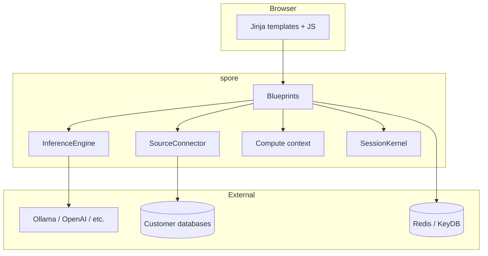
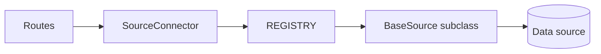

# Architecture

ScalAble (**Spore** backend) is a Flask application that turns natural-language questions into SQL, runs queries against connected data sources, and supports notebook-style analysis via Jupyter kernels over WebSockets.

## High-level diagram

## Package layout

| Module | Path | Responsibility |
|--------|------|----------------|
| App factory | `spore/_app.py` | Flask app, Redis sessions, blueprint registration, SocketIO |
| Routes | `spore/_routes/` | HTTP handlers and SSE streams |
| Inference | `spore/_engine/` | LangChain LLM, NL→SQL streaming |
| Connectors | `spore/_connectors/` | `BaseSource` implementations and `REGISTRY` |
| Compute | `spore/_compute/context.py` | Session connectors, materialized relations |
| Kernel | `spore/_kernel/` | Per-session Jupyter kernels |
| Config | `spore/_config/` | Env settings, vendor forms, `settings.json` |
| Frontend | `frontend/src/templates/` | Jinja UI and static assets |

## Active vs legacy code

**Registered blueprints** (`spore/_app.py`):

- `interface` — landing page
- `connections` — connection wizard and registry
- `workspace` — chat, query preview, materialize, relations

**Legacy (not registered):**

- `spore/_routes/endpoints.py` — older upload/chat/settings routes
- `spore/_engine/query_executor.py` — direct psycopg2/pyodbc/Mongo execution

Prefer extending `workspace` and `SourceConnector` rather than reviving legacy modules without review.

## Natural language to SQL flow

1. User selects a saved connection and sends a message on `/chat/ask`.
2. `workspace.ask()` loads connection metadata from the Flask session.
3. `get_engine()` returns a singleton `InferenceEngine` configured from `settings.json`.
4. `InferenceEngine.generate()` streams tokens from the LLM using a system prompt that requires XML output:
   - `<query>...</query>` — SQL or source-specific query
   - `<comment>...</comment>` — short explanation
5. The frontend (`notebook.js`) parses streamed tokens and displays the query for user review.
6. User runs **preview** (`/query-preview`) or **materialize** (`/materialize`) separately.

Design intent: the LLM proposes SQL; the user approves before execution (pushdown to the database).

## Query execution paths

### Preview (live, chunked SSE)

`SourceConnector.preview()` → `BaseSource.preview()` → yields SSE chunks to the browser.

PostgreSQL uses ADBC for efficient chunked reads. Preview is limited (default 500 rows).

### Materialize (Parquet on disk)

`POST /materialize` runs `connector.ingest()`:

1. Executes the query against the source.
2. Writes Parquet under `SPORE_DATA_DIR`.
3. Records a **relation** in `session['relations']` with host and kernel paths.

The Jupyter kernel reads materialized data from `KERNEL_DATA_MOUNT` (e.g. `/data/stream_xxx.parquet`).

### Notebook kernel (Socket.IO)

`kernel_execute` runs arbitrary Python in an isolated Jupyter kernel per Socket.IO session (`request.sid`). Output streams back as `kernel_output` events (text, plots via Plotly, etc.).

## Session model

There is **no user login**. State is stored in a **signed Flask session** backed by Redis:

| Session key | Contents |
|-------------|----------|
| `connections` | Saved data sources (Fernet-encrypted credentials, metadata) |
| `relations` | Materialized Parquet relations for notebook use |

Connection IDs use `uuid7` from `uuid_extensions`.

## Connector architecture

- **`BaseSource`**: ABC with `connection_context()` (SSH tunnel), `test_connection`, `fetch_metadata`, optional `preview` / `ingest`.
- **`SourceConnector`**: Facade that decrypts creds and delegates to the registry class.
- **`REGISTRY`**: Maps `source_type` string → class. Currently: `postgresql`, optional `bigquery`, `snowflake`.

Additional connector files exist under `_connectors/db/`, `warehouse/`, `files/`, `api/` but are not all registered yet.

## Inference engine

`InferenceEngine` (`spore/_engine/inference_engine.py`):

- Providers: `ollama`, `openai`, `anthropic`, `gemini`, `lmstudio`
- Keeps `ChatMessageHistory` (last ~20 turns)
- Prompt rules: push filters/aggregations into SQL; avoid pulling full tables into pandas in generated code

`model_manager.get_engine()` builds the engine from `load_settings()` once per process until `reset_engine()` is called.

## Frontend integration

- **Templates:** `frontend/src/templates/pages/*.html`
- **Static:** `frontend/src/templates/pages/static/` → `/static/`
- **Chat:** SSE to `/chat/ask`, `/query-preview`; Socket.IO for kernels
- **HTMX:** Connection wizard partials (`partials/form.html`)

## Data directories

| Path | Purpose |
|------|---------|
| `data/` | Default `SPORE_DATA_DIR` for Parquet |
| `logs/` | Application logs (gitignored) |

## Extension points

1. **New connector:** subclass `BaseSource`, register in `registry.py`, add `VENDOR_CONFIG` entry — see [CONNECTORS.md](CONNECTORS.md).
2. **New route:** new blueprint + register in `_app.py`.
3. **New LLM provider:** extend `InferenceEngine._initialize_llm()` and `PROVIDER_FIELDS`.

## Related documentation

- [DESIGN.md](../DESIGN.md) — product goals and design decisions
- [API.md](API.md) — route reference
- [CONNECTORS.md](CONNECTORS.md) — connector development guide
